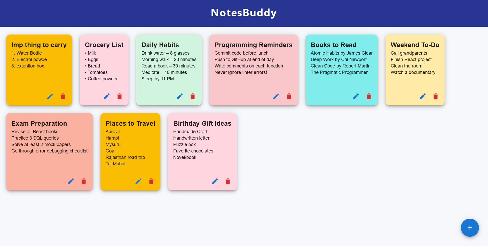
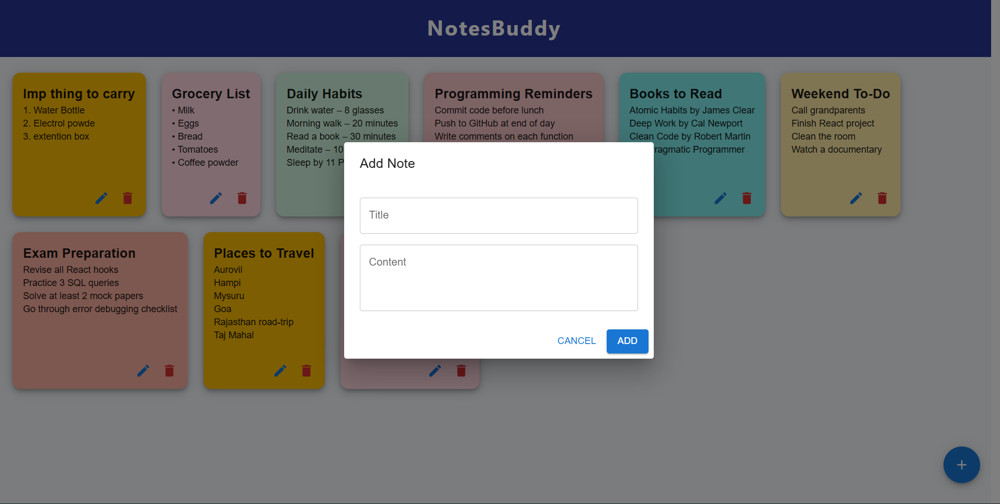
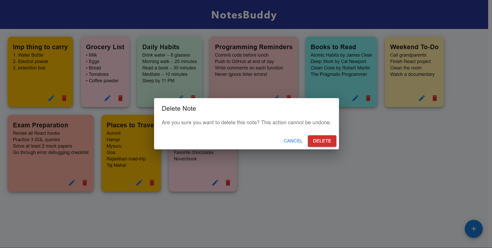
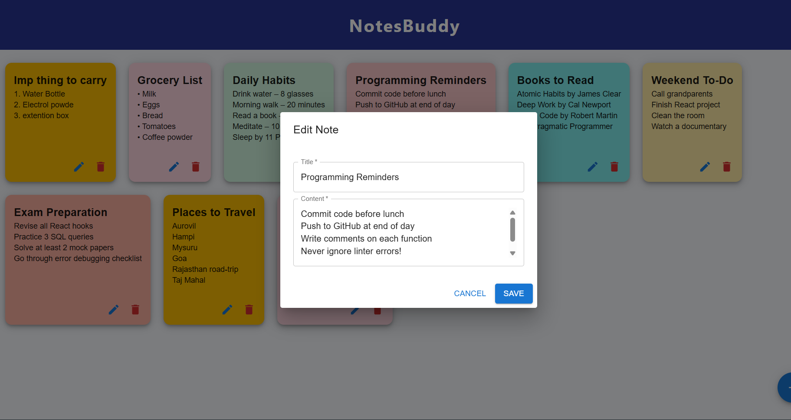

# NotesBuddy

NotesBuddy is a colorful, fast, and full-featured Google Keep-style note-taking web app.  
Built with React and Material UI, it supports **Create, Read, Update, Delete** (CRUD) features with a clean card interface.

---

## Features

- 📒 Add, edit, and delete notes instantly
- 🖍️ Each note displays as a vibrant card
- 💾 Data is persisted via an ASP.NET backend (customizable)
- 🖊️ Multiline content support (press Enter for new lines)
- 🧩 Confirmation dialog before deletes
- 🖼️ Fully responsive and visually appealing

---

## Demo Screenshots

### NotesBuddy Main Grid

### NotesBuddy Create new Note

### Delete Confirmation Dialog

### Editing a Note

---

## How to Run

### 1. API Backend

- Set up and run the ASP.NET Core API as per your solution (default endpoint: `https://localhost:7213/api/notes`).

### 2. React Frontend

- In this repo folder run:
npm install
npm start

text

- The frontend runs at `http://localhost:3000`.

---

## Directory Structure

src/
components/
NotesGrid.js // Main notes display
NoteCard.js // Card for each note
AddNote.js // Add new note dialog
EditNote.js // Edit note dialog
ConfirmDialog.js // Delete confirmation dialog
App.js // App root and app bar
public/
images/ // Place the screenshots above here for README display

text

---

## Technologies Used

- React.js + Material-UI
- ASP.NET Core Web API
- Axios for network calls

---

## Credits

- App concept inspired by Google Keep
- UI styling with Material UI

---

*Feel free to contribute or suggest new features!*